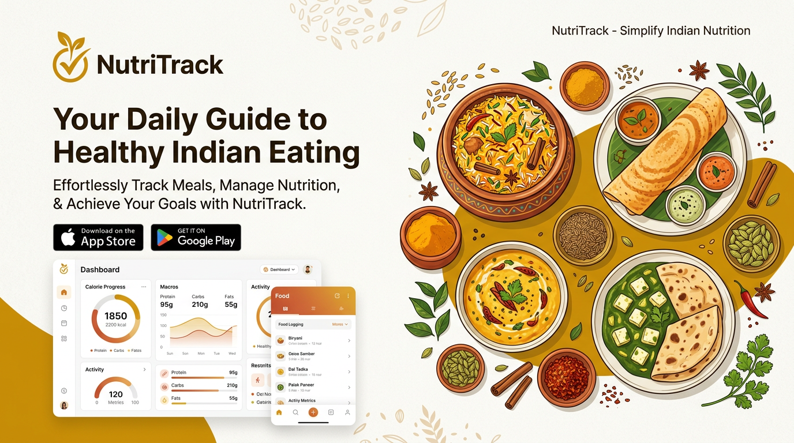

<div align="center">

<!-- HERO BANNER -->


# 🥗 NutriTrack
### *Desi Nutrition, Decoded. Track Every Roti, Every Calorie.*

<p align="center">
  <b>The Smartest Indian Nutrition Tracker</b> — built for the way India actually eats.<br/>
  From <code>Chole Bhature</code> to <code>Gajar ka Halwa</code>, <code>Idli Sambar</code> to <code>Laal Maas</code> — log it, track it, master it.
</p>

<p align="center">
  <a href="https://nextjs.org/"></a>
  <a href="https://react.dev/"></a>
  <a href="https://www.typescriptlang.org/"></a>
  <a href="https://firebase.google.com/"></a>
  <a href="https://tailwindcss.com/"></a>
</p>

<p align="center">
  
  
  
  
  
  
</p>

> **“Finally, a calorie tracker that knows what Dal Makhani is.”**

[✨ Features](#-features-that-slap) · [🚀 Live Demo](#) · [📸 Screenshots](#-screenshots) · [⚡ Quick Start](#-quick-start) · [🏗️ Architecture](#️-architecture--data-flow)

</div>

---

## 📑 Table of Contents

<details>
<summary><b>Click to expand</b></summary>

- [Why NutriTrack?](#-why-nutritrack)
- [Features That Slap](#-features-that-slap)
- [Screenshots](#-screenshots--pages)
- [Tech Stack](#️-tech-stack)
- [Architecture & Data Flow](#️-architecture--data-flow)
- [Database — 1000+ Indian Foods](#-database--1000-indian-foods)
- [Design System](#-design-system)
- [Quick Start](#-quick-start)
- [Environment Variables](#-environment-variables)
- [Project Structure](#-project-structure)
- [Available Scripts](#-available-scripts)
- [Deployment](#-deployment--firebase-app-hosting)
- [Security Model](#-security-model--firestore-rules)
- [Roadmap](#-roadmap)
- [Contributing](#-contributing)
- [License](#-license)

</details>

---

## 🤔 Why NutriTrack?

Most nutrition apps are built for **avocados and quinoa**. India eats **Rajma Chawal, Appam with Stew, Kosha Mangsho, and Dhokla**.

**NutriTrack** is the first tracker that **gets Indian food right**:

| The Problem 😒 | NutriTrack Fix ✅ |
|---|---|
| “1 roti = ???” confusion | Precise serving sizes: *“1 Phulka (With Ghee) — 105 kcal”* |
| Veg / Non-veg chaos | One-tap **🌿 Veg Only** filter — synced to your profile & Firestore |
| Generic US database | **1,000+ dishes** — North, South, West, East, North-East, hand-curated + procedurally expanded |
| Boring spreadsheets | **Gorgeous dashboard**: weekly bar charts, macro rings, progress bars |
| “What should my calories be?” | **BMR + TDEE calculator** (Mifflin-St Jeor) with Activity & Goal multipliers |

> **Tagline:** *Not just counting calories. Celebrating curries.*

---

## 🔥 Features That Slap

<table>
<tr>
<td width="50%">

### 📊 1. Command Center Dashboard
- **Live Today Totals** — calories, protein, carbs, fats vs. goal
- **Weekly Progress** — Recharts bar graph (last 7 days)
- **Recent Meals** — last 5 logs, quick history
- **Veg Only Toggle** with real-time Firestore sync
- **Namaste!** personalized greeting


</td>
<td width="50%">

### 🍛 2. Log Indian Meal — The Star
- Search **1,000+ foods** instantly
- Filter by **All / Breakfast / Lunch / Snacks / Dinner**
- **Quantity Picker** (0.5x steps) with live kcal math
- “**New Meal Plate**” card — build, tweak (+/-), remove, and log in batch
- **Daily Overview Modal** — see logged + plated totals before you commit


</td>
</tr>
<tr>
<td>

### 🎯 3. Goals That Actually Calculate
- **Step 1:** BMR → TDEE via **Mifflin-St Jeor**  
  `Gender × Age × Weight × Height × Activity × Goal`
- Goals: **Fat Loss (-400)** · **Maintenance** · **Muscle Gain (+300)**
- **Step 2:** Macro Sliders — protein / carbs / fats (0-400g)
- Live **Energy Breakdown Bar** + % donut
- Persists to `/userProfiles/{uid}/userGoal/userGoal`


</td>
<td>

### 📚 4. Indian Food Database
- **1,000 rows**: 50 artisanal (Butter Chicken, Masala Dosa, Thepla…) + 950 region-varied
- Columns: Name • Serving • kcal • P • C • F • Category • Veg indicator 🟢/🔴
- **Infinite vibes:** category dropdown + All/Veg/Non-Veg chips
- **Load More 50** pagination — no lag, instant `useMemo` filtering


</td>
</tr>
<tr>
<td>

### 💡 5. Nutrition Tips
Curated, desi-smart advice: *“Start with salad to control glucose spikes from Rice or Roti.”*  
*“Include Dal or Paneer in every meal for protein.”*

</td>
<td>

### 🔐 6. Auth & Profile
- Firebase Auth (email + **Anonymous Guest**)
- Sidebar shows avatar + email, **Log out** with `signOut()`
- All data **scoped to `uid`** — nobody sees your biryani history 😋

</td>
</tr>
</table>

> **Bonus:** Fully responsive, dark-mode ready, Inter font system, shadcn/ui + Radix primitives, buttery animations.

---

## 📸 Screenshots & Pages

> Replace placeholders with your own `screely` / screenshots. Layout is described so reviewers *feel* it.

| Route | What You See | Vibe |
|---|---|---|
| **`/` Dashboard** | 4 macro cards (Flame/Dna/Wheat/Droplets), weekly bar chart, quick tips, recent meals | Clean, card-based, `bg-primary/10` icons |
| **`/log`** | Left: searchable food list • Right: sticky “New Meal” plate + quantity dialog + daily total modal | Two-column, `rounded-[2rem]`, marketplace feel |
| **`/goals`** | Calculator form (gender/age/weight/height/activity/goal) → big `6xl` kcal reveal → macro sliders | Wizard-like, Step 1 → Step 2 |
| **`/database`** | Full table, 6 columns, filter bar, `Load 50 More` | Dense but readable, `hover:bg-primary/5` |
| **`/login`** | Firebase Auth, guest hint | Minimal, centered |
| **`/tips`** | Line-icon cards, Indian motifs | Warm & editorial |

<details>
<summary>🎥 Want a demo GIF? Record it!</summary>

```bash
# Run dev, record with your favorite tool
npm run dev # -> http://localhost:9002
# Then drop a gif in ./docs/demo.gif and link it here:
# 
```

</details>

---

## 🛠️ Tech Stack

<div align="center">

| Layer | Technology | Why It Slaps |
|---|---|---|
| **Framework** | **Next.js 15.5.9** (App Router, Turbopack) | File-based routing, RSC, crazy fast HMR |
| **UI** | **React 19** + **TypeScript 5** | Latest concurrent features, strict types |
| **Styling** | **Tailwind CSS 3.4.1** + **tailwindcss-animate** | Utility-first, design tokens via CSS vars |
| **Components** | **shadcn/ui** • **Radix UI** (Accordion, Dialog, Select, Slider, etc.) | Accessible, headless, beautiful |
| **Icons** | **lucide-react 0.475** | Clean line icons, tree-shakable |
| **Charts** | **Recharts 2.15.1** | BarChart for weekly trends |
| **Forms** | **react-hook-form** + **zod** + **@hookform/resolvers** | Validation, perf |
| **Backend** | **Firebase 11.9.1** (Auth • Firestore • App Hosting) | Real-time, serverless, rules |
| **Fonts** | **Inter** (Google Fonts) | `font-body` & `font-headline` unified |
| **Deploy** | **Firebase App Hosting** (`apphosting.yaml` → `maxInstances: 1`) | Zero-config Next.js hosting |

</div>

**Key Config:**

```ts
// next.config.ts — images, TS/ESLint relaxed for speed
images: {
  remotePatterns: [
    { protocol: 'https', hostname: 'placehold.co' },
    { protocol: 'https', hostname: 'images.unsplash.com' },
    { protocol: 'https', hostname: 'picsum.photos' },
  ]
}
```

---

## 🏗️ Architecture & Data Flow

```mermaid
graph TD
    A[User — Browser] --> B[Next.js 15 App Router<br/>src/app/layout.tsx<br/>SidebarProvider + AppSidebar]
    B --> C{Route}
    C -->|/| D[Dashboard — page.tsx<br/>SummaryCards + Recharts]
    C -->|/log| E[Log Meal — plate builder<br/>Search + Veg Toggle]
    C -->|/goals| F[Goals — BMR/TDEE calc<br/>Macro Sliders]
    C -->|/database| G[Database — 1000 rows<br/>Table + Filters]
    C -->|/tips| H[Tips — static guidance]

    D & E & F --> I[Firebase SDK<br/>useUser / useFirestore / useCollection]
    I --> J[(Firestore<br/>userProfiles / mealLogs / userGoal<br/>foodItems)]

    J --> K[Security Rules<br/>firestore.rules<br/>isOwner(uid) + isAdmin()]
    I --> L[Firebase Auth<br/>Anonymous + Email]

    E --> M[mock-data.ts<br/>INDIAN_FOOD_DATABASE<br/>FOOD_BY_ID Map O1]
    M --> N[950 Procedural + 50 Curated]
```

**State Flow (Example: Logging a Meal):**

```
User searches "Biryani" → filteredFoods (useMemo) → clicks [+] → Dialog (pick 1.5x)
→ selectedItems state → "Log This Meal" → addDocumentNonBlocking() per item
→ collection: userProfiles/{uid}/mealLogs → Dashboard auto-updates via useCollection
```

---

## 🍱 Database — 1000 Indian Foods

**Source:** `src/lib/mock-data.ts` — O(1) lookup via `Map<string, FoodItem>`

- **50 Curated:** `Chole Bhature`, `Butter Chicken`, `Masala Dosa`, `Vada Pav`, `Macher Jhol`, `Thukpa`, `Lauki Ki Sabzi`… each with real macros & serving
- **950 Procedural:** Cartesian of `[14 Regions] × [12 Ingredients] × [10 Types]` — gives you `Kerala Mushroom Pickle`, `Punjabi Chicken Pulao` etc.

```ts
export interface FoodItem {
  id: number;
  name: string;        // "Hyderabadi Chicken Biryani"
  calories: number;    // 580
  protein: number;     // 32
  carbs: number;       // 70
  fats: number;        // 18
  category: string;    // "Main Course" | "Lentils" | "Snack" ...
  isVeg: boolean;      // 🟢 / 🔴
  servingSize: string; // "350g" | "2 idlis + 150ml Sambar"
}

export const FOOD_BY_ID = new Map<string, FoodItem>(
  INDIAN_FOOD_DATABASE.map(f => [f.id.toString(), f])
);
```

**Try it:** `FOOD_BY_ID.get("7") // → Chicken Biryani 520 kcal, 28P/65C/15F`

---

## 🎨 Design System

Inspired by **Indian spice bazaars, not Silicon Valley gray**:

| Token | Value | Usage |
|---|---|---|
| `--primary` | `42 88% 41%` → **#C68C09** Mustard | Buttons, charts, active nav |
| `--accent` | `21 89% 53%` → **#F2651A** Terracotta | CTAs, highlights |
| `--background` | `40 50% 94%` → **#F9F3E7** Warm Off-White | Page bg |
| `--radius` | `0.75rem` | Cards, `rounded-[2rem]` on hero cards |
| Font | **Inter** 400/500/600/700 | `font-body` everywhere |

```css
/* src/app/globals.css */
:root {
  --primary: 42 88% 41%;
  --accent: 21 89% 53%;
  --background: 40 50% 94%;
}
.dark {
  --background: 20 20% 10%;
  --primary: 42 88% 41%;
}
```

> **Tailwind loves it:** `bg-primary`, `text-primary-foreground`, `border-border/50`, `shadow-lg shadow-primary/20` — all wired via `tailwind.config.ts`.

---

## ⚡ Quick Start

### Prerequisites

- **Node.js ≥ 18** (20 recommended) + `npm` / `yarn` / `pnpm`
- A **Firebase project** (free tier is fine)

### 1. Clone & Install

```bash
git clone https://github.com/priyanshu8007b/NutriTrack.git
cd NutriTrack
npm install
# or
yarn install
# or
pnpm install
```

### 2. Firebase Setup

1. Go to [Firebase Console](https://console.firebase.google.com/) → Create project
2. Enable **Authentication** → Sign-in method → **Anonymous + Email/Password**
3. Enable **Firestore Database** → Start in test mode (we’ll lock it with `firestore.rules`)
4. Project Settings → General → Your apps → Web app → Copy config

### 3. Environment Variables

Create `.env.local` in root:

```env
NEXT_PUBLIC_FIREBASE_API_KEY=your_api_key
NEXT_PUBLIC_FIREBASE_AUTH_DOMAIN=your_project.firebaseapp.com
NEXT_PUBLIC_FIREBASE_PROJECT_ID=your_project_id
NEXT_PUBLIC_FIREBASE_STORAGE_BUCKET=your_project.appspot.com
NEXT_PUBLIC_FIREBASE_MESSAGING_SENDER_ID=1234567890
NEXT_PUBLIC_FIREBASE_APP_ID=1:123456:web:abcdef
# Optional — if you use Firebase Admin / Genkit AI:
# GOOGLE_GENAI_API_KEY=...
```

> The app uses `NEXT_PUBLIC_*` so the SDK can run client-side via `src/firebase/*`. No secret server keys needed for the base flow.

### 4. Run Dev

```bash
npm run dev
# → http://localhost:9002  (note: custom port via -p 9002, not 3000!)
```

You should see **“Namaste!”** + dashboard. Try toggling **🌿 Veg Only** and logging a **Masala Dosa**.

### 5. Build & Check

```bash
npm run build
npm start
npm run typecheck   # tsc --noEmit
npm run lint
```

---

## 🔐 Environment Variables

| Var | Required | Where |
|---|---|---|
| `NEXT_PUBLIC_FIREBASE_API_KEY` | ✅ | Client — Auth & Firestore |
| `NEXT_PUBLIC_FIREBASE_AUTH_DOMAIN` | ✅ | Client |
| `NEXT_PUBLIC_FIREBASE_PROJECT_ID` | ✅ | Client |
| `NEXT_PUBLIC_FIREBASE_STORAGE_BUCKET` | ✅ | Client |
| `NEXT_PUBLIC_FIREBASE_MESSAGING_SENDER_ID` | ✅ | Client |
| `NEXT_PUBLIC_FIREBASE_APP_ID` | ✅ | Client |

<details>
<summary>Full example <code>.env.local</code></summary>

```env
NEXT_PUBLIC_FIREBASE_API_KEY=AIzaSy...
NEXT_PUBLIC_FIREBASE_AUTH_DOMAIN=nutritrack-demo.firebaseapp.com
NEXT_PUBLIC_FIREBASE_PROJECT_ID=nutritrack-demo
NEXT_PUBLIC_FIREBASE_STORAGE_BUCKET=nutritrack-demo.appspot.com
NEXT_PUBLIC_FIREBASE_MESSAGING_SENDER_ID=987654321
NEXT_PUBLIC_FIREBASE_APP_ID=1:987654:web:abc123def456
NEXT_PUBLIC_FIREBASE_MEASUREMENT_ID=G-ABCDEF1234
```

</details>

---

## 📁 Project Structure

```bash
NutriTrack/
├── docs/
│   ├── backend.json      # Data model spec (UserProfile, FoodItem, MealLog…)
│   ├── blueprint.md      # Original PaushtikPath spec
│   └── hero-banner.png   # This README’s banner ✨
├── src/
│   ├── ai/
│   │   ├── dev.ts
│   │   ├── genkit.ts
│   │   └── flows/smart-indian-meal-suggestion.ts  # stubbed AI flow
│   ├── app/
│   │   ├── layout.tsx    # RootLayout + SidebarProvider + FirebaseClientProvider
│   │   ├── globals.css   # Tokens: mustard, terracotta, off-white
│   │   ├── page.tsx      # Dashboard — SummaryCards + Weekly Recharts
│   │   ├── log/page.tsx        # Log Meal — plate builder
│   │   ├── goals/page.tsx      # Goals — BMR/TDEE + macro sliders
│   │   ├── database/page.tsx   # DB — searchable table
│   │   ├── suggestions/page.tsx
│   │   ├── tips/page.tsx
│   │   ├── login/page.tsx
│   │   └── favicon.ico
│   ├── components/
│   │   ├── app-sidebar.tsx     # Nav: Dashboard/Log/Goals/Database/Tips
│   │   └── ui/                 # shadcn: button, card, dialog, slider…
│   ├── firebase/               # useUser, useFirestore, useDoc hooks
│   ├── hooks/use-toast.ts
│   └── lib/
│       ├── mock-data.ts        # 1000 foods + FOOD_BY_ID + DEFAULT_GOALS
│       ├── placeholder-images.*
│       └── utils.ts            # cn()
├── components.json       # shadcn config
├── firestore.rules       # 🔒 Strict owner + admin rules
├── .firebaserc           # project: studio-6309201830-50521
├── apphosting.yaml       # Firebase App Hosting: maxInstances 1
├── next.config.ts        # images.remotePatterns + ignoreBuildErrors
├── tailwind.config.ts    # Inter, chart colors, sidebar tokens
├── tsconfig.json
└── package.json
```

---

## 📜 Available Scripts

| Command | What It Does |
|---|---|
| `npm run dev` | `next dev --turbopack -p 9002` — dev with Turbopack on 9002 |
| `npm run build` | `NODE_ENV=production next build` |
| `npm start` | `next start` — prod server |
| `npm run lint` | `next lint` |
| `npm run typecheck` | `tsc --noEmit` |

---

## 🚀 Deployment — Firebase App Hosting

This repo is **App Hosting ready**. No Vercel needed.

```yaml
# apphosting.yaml
runConfig:
  maxInstances: 1
```

```bash
# Install Firebase CLI if needed
npm i -g firebase-tools
firebase login
firebase apphosting:backends:create   # first time
firebase deploy              # or
firebase apphosting:rollouts:create -b <backendId>
```

`next.config.ts` already whitelists `placehold.co`, `images.unsplash.com`, `picsum.photos`.

---

## 🔒 Security Model — Firestore Rules

Philosophy: **Strict path-based ownership + RBAC via `roles_admin`**.

```js
// firestore.rules (simplified)
match /userProfiles/{userId} {
  allow get, list: if isOwner(userId);
  allow create, update, delete: if isOwner(userId);

  match /mealLogs/{mealLogId} {
    allow get, list: if isOwner(userId);
    allow create, update, delete: if isOwner(userId);
  }
  match /userGoal/{goalId} {
    allow get, list: if isOwner(userId);
    allow create, update, delete: if isOwner(userId);
  }
}
match /foodItems/{foodItemId} {
  allow get, list: if true;          // public catalog
  allow create, update, delete: if isAdmin();
}
```

- `isOwner(userId) = request.auth.uid == userId`
- `isAdmin() = exists(/roles_admin/$(request.auth.uid))`
- No one can read another user’s `mealLogs`. Ever.

---

## 🗺️ Roadmap

- [ ] **AI Smart Suggestions** — finish `smart-indian-meal-suggestion` Genkit flow (analyze deficits → suggest *“Add 100g Paneer Tikka (18P) to hit protein”*)
- [ ] **Barcode / Photo Log** — snap a thali, auto-detect via Vision
- [ ] **Weekly Email Report** — Cloud Functions + SendGrid
- [ ] **Social:** Shareable “My Thali Score” cards
- [ ] **PWA + Offline** — cache food DB, queue logs
- [ ] **Regional Languages** — Hindi, Tamil, Bengali i18n
- [ ] **Admin CMS** for `foodItems` (edit macros without code)

> Have an idea? [Open an issue](https://github.com/priyanshu8007b/NutriTrack/issues) or PR!

---

## 🤝 Contributing

We love PRs — especially new **curated foods**!

1. Fork → `git checkout -b feat/add-food`
2. Add to `BASE_DATABASE` in `src/lib/mock-data.ts`
3. `npm run typecheck && npm run build`
4. Commit → Push → Open PR

**Commit style:** `feat:`, `fix:`, `docs:`, `style:`, `refactor:`

```bash
git commit -m "feat: add Gongura Mamsam (Andhra) — 380 kcal, 28P"
```

---

## 📄 License

**MIT** — do whatever you want, just keep the *Namaste*.

> No `LICENSE` file yet? Add one: `npx generate-license MIT`

---

<div align="center">

### Built with ❤️ for every Indian kitchen

**NutriTrack** — *Eat like you mean it.*

`#C68C09` Mustard · `#F2651A` Terracotta · `#F9F3E7` Off-White · **Inter**

[⬆ Back to Top](#-nutritrack)

<br/>

<sub>
  Crafted by <a href="https://github.com/priyanshu8007b">priyanshu8007b</a> • 
  Inspired by <b>PaushtikPath</b> blueprint • 
  Powered by Next.js, Firebase & a lot of ghee
</sub>

</div>
